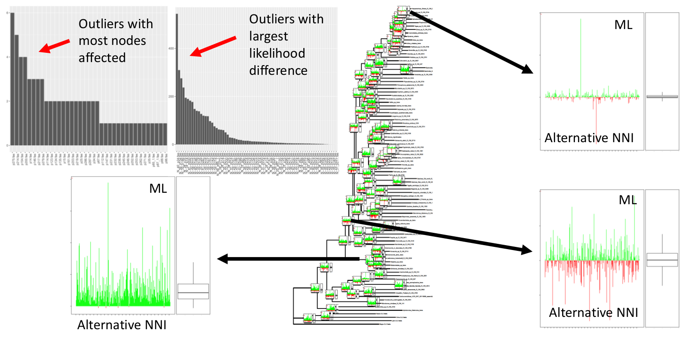

# PLS
Partitioned Likelihood Support using NNI comparisons

Conflict is evaluated for each branch by comparing LnLs between different NNI configurations (with the rest of the tree fixed) per each partition or position.

## References
Lee and Hugall. 2003. Partitioned Likelihood Support and the Evaluation of Data Set Conflict. Systematic Biology, 52(1), 15-22.

Shen, Hittinger, and Rokas. 2017. Contentious relationships in phylogenomic studies can be driven by a handful of genes. Nature Ecology & Evolution, 1(5), 0126.

Anisimova and Gascuel. 2006. Approximate likelihood-ratio test for branches: a fast, accurate, and powerful alternative. Systematic biology, 55(4), 539-552.



## Installation

Simply copy the files or clone the repo
```
git clone https://github.com/AlexKnyshov/PLS
```

## Dependencies
Python 2

R with the following packages installed
- ape
- phangorn
- ggplot2
- grid
- gridExtra
- ggtree

RAxML or IQ-TREE


## Input
As input, the following files are needed:
- a (concatenated) alignment
- a partition file (currently, RAxML format is supported)
- an ML phylogeny in Newick format

## Workflow

(Adjust commands to provide a correct path to scripts and programs)

#### Step 1

Assuming `MLtreefile.tre` is the ML phylogeny being tested, obtain the NNI topologies:
```
Rscript ./nniR.R MLtreefile.tre
```
Output is written to `pls_nni_tree.tre`

#### Step 2

Assuming `alignment.phy` is the alignment file and `partitions.txt` is the partition scheme, evaluate likelihood of all trees using either:
```
iqtree -nt 2 -s ./alignment.phy -spp ./partitions.txt -z pls_nni_tree.tre -wsl -pre calcPLS -n 0
```
Or if the ML partition model has been optimized and saved to a file `analysis.best_model.nex`:
```
iqtree -nt 2 -s ./alignment.phy -spp ./analysis.best_model.nex -z pls_nni_tree.tre -wsl -pre calcPLS -n 0
```
Or using RAxML:
```
raxmlHPC -T 2 -f g -s ./alignment.phy -q partitions.txt -m GTRGAMMA -z pls_nni_tree.tre -n calcPLS
```
Given the prefix parameter in the examples above, the output is written to calcPLS.sitelh (in case of IQ-TREE) or RAxML_perSiteLLs.calcPLS (in case of RAxML). Adjust the prefix parameteres if needed. Adjust the -nt (IQ-TREE) or -T (RAxML) parameter according to number of cores (threads) to be used for calculations.

#### Step 3

Assuming the output file name at the previous step is `calcPLS.sitelh`, calculate the per-partition sum of LnLs using the partitioning scheme of interest (usually the original partitioning scheme):
```
python ./PLS.py -prt calcPLS.sitelh partitions.txt
```
Output is saved to `pls_prtlls.csv`. Other options available to use site likelihoods (no summation, just reformatting) or to sum over regular intervals.

#### Step 4

Finally, calculate per partition difference, export tables and draw plots:
```
Rscript ./PLS.R -g pls_prtlls.csv MLtreefile.tre
```
Next best NNI (with respect to ML) is selected by using total LnL of the trees.
Output files are as follows:
- `pls_annotated_tree.pdf` - input phylogeny with PLS plots
- `pls_datalist.csv` - LnL difference table
- `pls_LnLdiff_outliers.csv` - Outliers ranked by absolute LnL difference
- `pls_LnLdiff_outliers.pdf` - Same, graphical output
- `pls_Nnode_outliers.csv` - Outliers ranked by number of nodes they are encountered at
- `pls_Nnode_outliers.pdf` - Same, graphical output
- `pls_nodeplots.pdf` - Node plots with LnL difference

Done